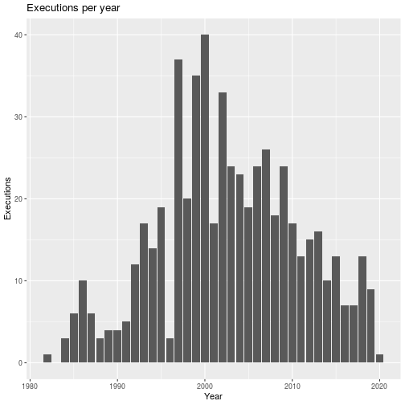
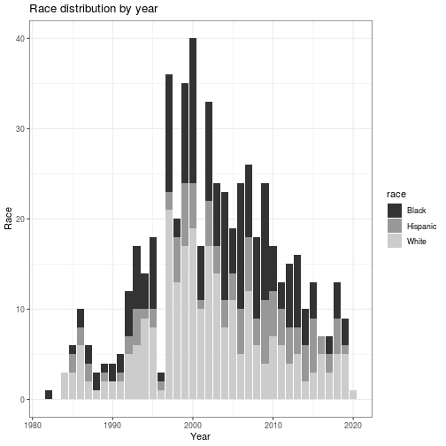
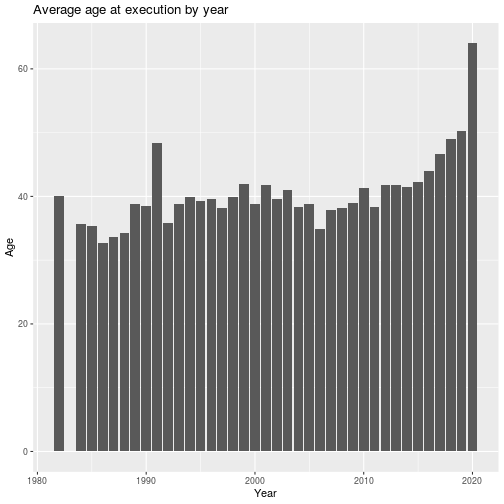
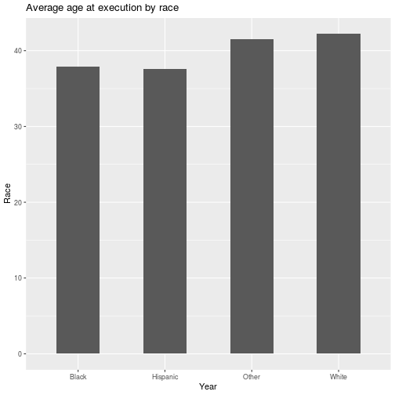
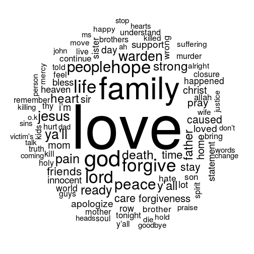
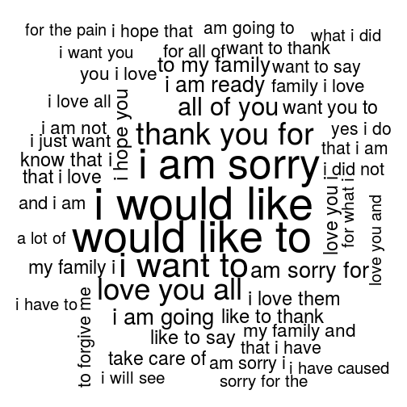
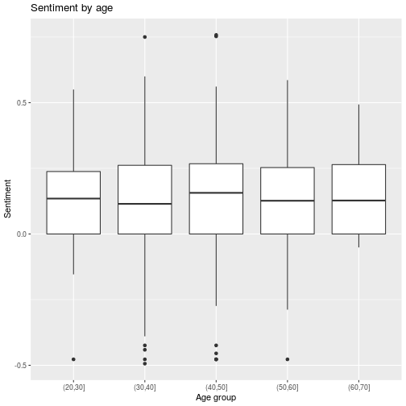
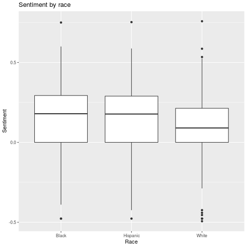

# Death row
Analysis of death row inmates' final statements before execution. Data scraped
from Texas Department of Criminal Justice website.

## General statistics

### Executions per year

### Race distribution by year

### Average age at execution by year

### Average age at execution by race

## Word clouds

### Most frequent words

### Most frequent phrases (trigrams)

## Sentiment analysis

#### Example of statements with negative sentiment

* goodbye to my family; i love all of you, i’m sorry for the victim’s family. i wish i could make it up to them. i want those out there to keep fighting the death penalty.
*Score: -0.4938035*

* i hereby declare, robert steven everett and nicholas velasquez, guilty of crimes against me, douglas alan feldman. either by fact or by proxy, i find them both guilty. i hereby sentence both of them to death, which i carried out in august 1998. as of that time, the state of texas has been holding me illegally in confinement and by force for 15 years. i hereby protest my pending execution and demand immediate relief.
*Score: -0.2881187*

* i just want to tell my mom that i am sorry that i caused her so much pain and my family and stuff.  i love them and i hurt for the the fact that they are going to be hurting.  i really hate that; and that i'm hoping they are going to be o.k.
*Score: -0.2739788*

* to kathy’s family and friends that were unable to attend today, i am truly sorry. i hope my dropping my appeal has in some way began your healing process. this is all i am going to do to help you out in any way for the nightmare and pain that i have caused you, but i am truly sorry and i wish i could take back what i did, but i can’t. i hope this heals you.
*Score: -0.2686052*

* the statement that i would like to make is, none of this should have happened and now that i'm dying, there is nothing left to worry about. i know it was a mistake. i have no one to blame but myself. it's no big deal about choosing right from wrong. i pray that everyone involved overlooks the stupidity. everybody has problems and i won't be a part of the problem anymore. i can quit worrying now, it was all a mistake. that's all i want to say.
*Score: -0.2527458*

* i pray with the help of god that you will forgive me for the pain i caused your family. i am truly sorry. i wish i could take it back, but i just pray and ask that you forgive me.
*Score: -0.2140202*

* i just ask everybody i ever hurt or done anything wrong to, to just forgive me for whatever wrongs i done to them.
*Score: -0.2085144*

* i do.  i am sorry.  i have always been sorry.  it is the worst mistake that i ever made in my whole life.  not because i am here, but because of what i did and i hurt a lot of people - you, and my family.  i am sorry; i have always been sorry.  i am sorry.  you look after each other.  i love you all.  be there for one another.  alright.  but i am sorry; very sorry.  i love you too.  alright.
*Score: -0.1874222*

* i would like to say first of all the real violent crimes in this case are acts committed by james boswell and clay morgan gaines. we have the physical evidence to prove fabrication and cover-up. the people responsible for killing me will have blood on their hands for an unprovoked murder. i am not guilty; i acted in self-defense and reflex in the face of a police officer who was out of control. james boswell had his head beat in; possibly due to this he had problems. my jurors had not heard about that. they did not know he had suffered a head injury from the beating by a crack dealer five months earlier; that he was filled with anger and wrote an angry letter to the houston chronicle. he expressed his frustration at the mayor, police chief and fire chief. he was mad at the world. three and a half months before i worked on a deal with the dea, the informant was let off. at the moment he left the courtroom, he became angry with me; officer boswell was upset about this. officer boswell and an angry woman were in the police car and they were talking in raised voices. in other words, officer boswell was angry at the time i walked up. officer boswell may have reacted to the...(offender stopped speaking in mid-sentence.)
*Score: -0.1759416*

* i would like to tell the canfield family i'm sorry; sorry for your loss. i wish i could take it back, but i can't. i hope this gives you closure. i did not murder your loved one, it was an accident. i didn't mean for it to happen. i take full responsibility.
*Score: -0.1659591*

#### Example of statements with positive sentiment

* a lot of people view what is happening here as evil, but i want you to know that i found love and compassion here. the people who work here, i thank them for the kindness they have shown me and i deeply appreciate all that has been done for me by the people who work here. that’s all, warden, i’m ready.
*Score: 0.4740662*

* i just want to tell my family i love them, and i thank the lord jesus for giving me another chance and for saving me.
*Score: 0.5100000*

* i would like to thank my friends and family for sticking with me through all of this. i would like to encourage my brothers to continue to run the race. i thank my father, god in heaven, for the grace he has granted me –  i am ready.
*Score: 0.5244305*

* i want to let all of my people know and everybody who is here and supported me that i love them and wish them all the best.
*Score: 0.5388603*

* yes, i would like to praise allah and i am praying to allah. allah is most gracious. i will ask allah for forgiveness because he created me and he will forgive me.
*Score: 0.5418007*

* yes sir, i want to say i love you to all my family and friends. thank you lord for your mercy and unconditional love. in jesus name i pray, amen.
*Score: 0.5446217*

* i would like to tell my family that i love them and always be strong and keep their heads up and keep faith in jesus.
*Score: 0.5500000*

* ms. craft and ms. bethrie, i don’t know what to say to you   but i apologize for the pain i have caused you and your family over the years. i   hope that you will accept my apology and that you will know that it is sincere.   i hope this will allow you and your family to move on and i hope you will   forgive me and i hope mr. hanon [illegible] will forgive me for taking   his life. please accept my apology. i love you all.
*Score: 0.5574825*

* yes, sir. i love you irene and i want to thank you for all the beautiful years of friendship and ministry. i love you.
*Score: 0.5830047*

* first, i would like to give praise to god for the love and grace that he has allowed for all of this to come together.
*Score: 0.6000000*

### Sentiment by age

### Sentiment by race

